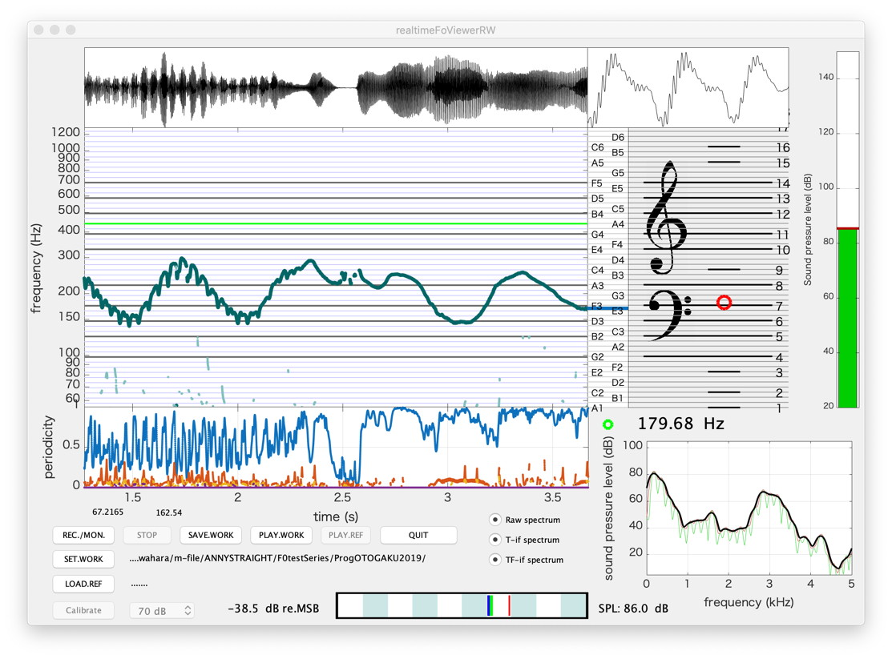
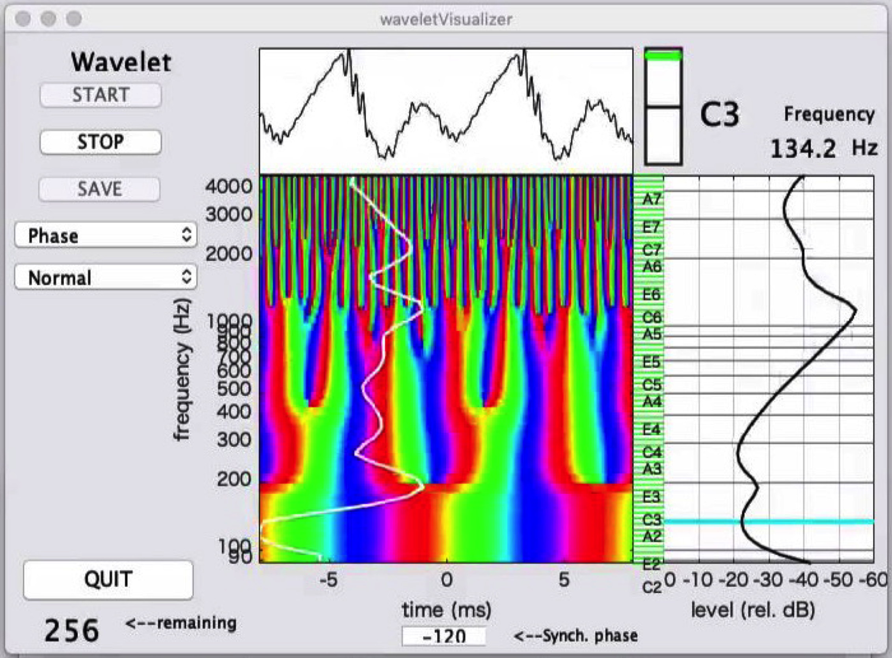
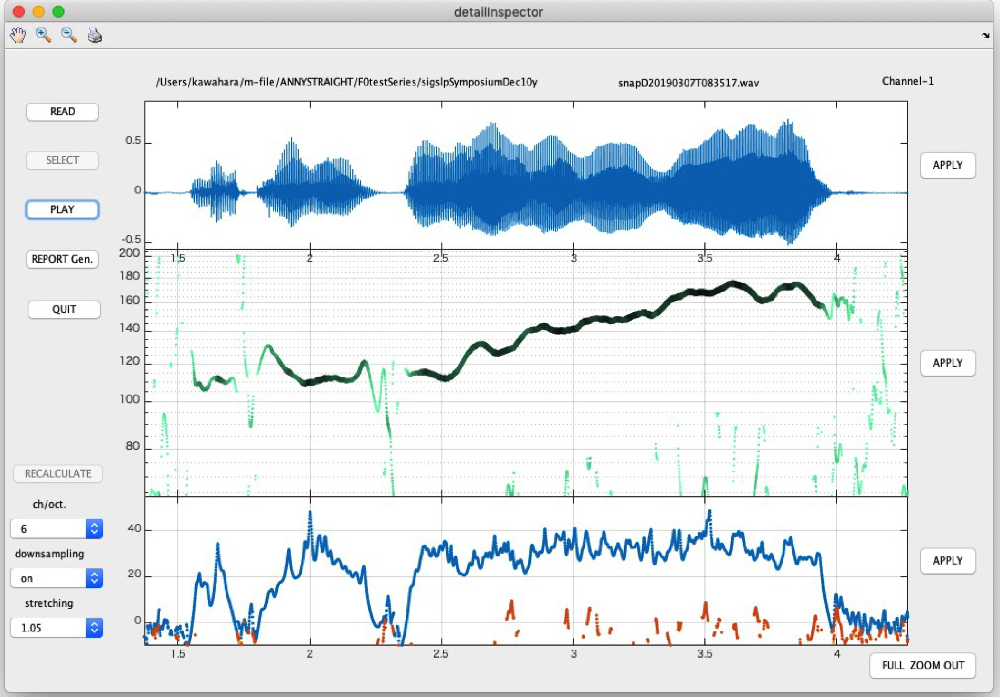

# voiceRTFB
Interactive and real-time tools for assisting voicing and singing training. One of the tools provides real-time visualization of primary attributes; the sound pressure level and candidates of the fundamental component. The other tool provides real-time visualization of low-level attributes; phase, amplitude, normalized instantaneous frequency, and normalized group delay. An interactive tool enables detailed analysis and reporting of the recorded voices.

## Installation

Clone or download this repository. Set working path of MATLAB to the src directory. Then, type the following commands. Each command invokes each GUI tool. Please click "QUIT" button for the first time.

```
realtimeFoSplViewer
waveletVisualizer
detailInspector
```

## Directories

This distribution has two direcotories, "src" and "doc". The "src" directory consists of GUI tools and component functions. The "doc" directory consists of the technical document and the reference manual with a brief introduction titled "Getting started".

### src

This directory consists of the following tools:

* realtimeFoSplViewer
* waveletVisualizer
* detailInspector
* voiceProfilerExperimentt 






### doc

(Tentatively place holder only)

## Links: reference

The following articles provides technical information.

* Hideki Kawahara, Ken-Ichi Sakakibara, Eri Haneishi, Kaori Hagiwara: Real-time and interactive tools for vocal training based on an analytic signal with a cosine series envelope, arXiv preprint arXiv:1909.03650, [PDF from arxiv.org](https://arxiv.org/pdf/1909.03650)

## Update history

### 13 June, 2023: fixed color related bugs
### 29 January, 2020: added a field rawSpectrogramNormalized which remove effects of windowing
### 26 October, 2019: added the experimental version of Valued Voice Range Profiler
### 16 September, 2019: added a link to arXiv
### 11 September, 2019: pre-release
